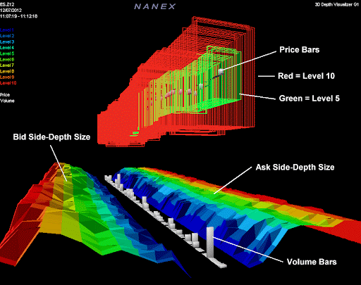

# More Advanced Latency Tricks!

Source HTML: [`html/2026-04-26-more-advanced-latency-tricks.html`](../html/2026-04-26-more-advanced-latency-tricks.html)

# More Advanced Latency Tricks!

| 항목 | 값 |
| --- | --- |
| 날짜 | 2026-04-26 |
| 접근 | 유료 |
| URL | https://www.algos.org/p/more-advanced-latency-tricks |
| 부제 | 6 Proprietary Tricks To Boost Your Latency |

---

[The Quant Stack](https://www.algos.org)

[More Advanced Latency Tricks!](https://www.algos.org/p/more-advanced-latency-tricks)

6 Proprietary Tricks To Boost Your Latency

[Quant Arb](https://substack.com/@quantarb)

Apr 26, 2026

∙ Paid

---

### Introduction

---

In today’s article, we will walk through 6 novel latency tricks for crypto exchanges which so far are entirely unseen. To date, none of these latency optimisations have been published for the public to view and are exclusively accessible to Quant Arb readers. I hope you all enjoy!

### Hot sub

---

If you start market making on various sub accounts at the same time, you’ll notice that for periods of time one of those sub accounts will be considerably faster than the rest of the sub accounts.

We can quite easily take advantage of this by maintaining multiple sub accounts, sending trivially wide orders every so often to test their speeds, and then switching our quotes over to the fastest sub account every time we get a new leader (given some minimal amount of time has passed to avoid excessive switching destroying our rate limit).

This is a bit more of a pain to implement and does mean your strategy will use up more capital as you now need to fund multiple accounts, but HFT strategies tend to be extremely capital efficient anyways and there are certainly worse optimisations to have to implement.

### Parsing Last Trade

---

When there are tons of trades in a very short period of time, the latency tends to spike, and not just on the network also on the compute side as well. As a result, it’s typically wise to parse the last trade first when this happens and ensure that the trade parsing happens on its own core so it doesn’t wreck the rest of the system.

### No Parsing

---

An even more advanced approach to this is to simply not parse the JSONs and read directly from the unparsed messages. This is fairly complicated to do, but it can be done and can save a lot of time with the parsing. You skip parsing certain things and skip directly to the meat of it. There’s also a high chance this causes tons of errors in your system and I probably wouldn’t recommend it unless you are really intense about your latency optimizations.

### HTTP Versions

---

Most exchange APIs support multiple HTTP versions. I haven’t found that any given version of HTTP works consistently better across exchanges, but it does vary and for some exchanges certain HTTP versions are superior in their performance and should be used when sending REST requests.

### REST Order Updates

---

This is another trick that is quite similar to limit IOC spamming where you can only realistically pull it off if you have really high rate limits or a rate limit bypass.

In some rare cases, you can get much faster updates on your fills (especially when latency spikes), by spamming REST requests to get updates on the status of your orders. This is fairly effective but will destroy your rate limits and increase your server load by a lot. You likely will need to enable it selectively (ie when the latency spikes it is automatically enabled).

### Hidden Endpoints

---

On a lot of exchanges, there are hidden endpoints that are not named in the documentation. For example, on Binance Futures, there is a feed called depth@0ms which is faster than the fastest feed listed in the documentation. It’s not actually 0ms or even real-time, it’s more like every 30ms when you actually look at the timestamps, but that’s still much faster than the next best which is 100ms.

21 Likes
