# 2026 06 08 Hft Alphas Pt 1

Source HTML: [`html/2026-06-08-hft-alphas-pt-1.html`](../html/2026-06-08-hft-alphas-pt-1.html)

### Introduction

---

In this new 5-part series of articles, I will be developing real HFT alphas using the research pipeline discussed in the previous article on HFT Alpha Research. In the first article (today’s article), we will present a basic set of features which explain a large portion of the overall variance. In the next article, we will expand this selection of features and use some more advanced features engineered from full depth orderbook data. In the 3rd article, we will expand our universe from BTC, ETH & SOL, to the top 30 assets by rolling 90d volume rank, and develop a cross-sectional factor model for the HFT timeframe. In the 4th article, we will use this factor model to test additional features, and we will also perform feature selection to form our final feature set. In the final article, we will test various models for forecasting forward returns. We use an incredibly large dataset of 1 year of second level tick data to perform this analysis and provide code to replicate the entire process at home. The final forecast aims to be worthy of being considered a starting point for market making and development. Moreso, we aim to show readers how to research a set of alphas, with the theory behind alphas explained in detail. If you have not already read the prior article on methodology please see the below article:

[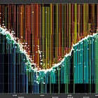

#### HFT Alpha Research 101

[Quant Arb](https://substack.com/profile/101799233-quant-arb)

·

Jun 3

[Read full story](https://www.algos.org/p/hft-alpha-research-101)](https://www.algos.org/p/hft-alpha-research-101)

By the end of this article, we will have found 7 features for the 5s timeframe and 5 features for the 15s timeframe. See the lists at the end for the final feature set.

### Index

---

1. Introduction
2. Index
3. The Data
4. The Alphas
5. Analysis
6. Conclusions

### The Data

---

Our analysis focuses solely on USD-M Binance Futures for USDT pairs. This is the most liquid market for trading digital assets. We will use the range of data from 2025-01-01 to 2025-12-31. Our data is tick level and encompasses every orderbook update, and every trade that occurred over that duration. We use BTCUSDT, ETHUSDT, and SOLUSDT for this analysis. In the later articles we will expand the universe, but shrink the date range (to keep things computationally feasible - full depth data is massive)

Data is where it all starts, and having a high quality data provider is one of the most important things to consider when doing HFT analysis. It is typical of most HFT firms that data is collected internally using custom data scrapers to ensure that the data has representative latency statistics of their actual setup. In lieu of this, we will be using Tardis, which is a high quality institutional dataset for tick data in digital asset markets. We use the below endpoints:

1. trades
2. quotes
3. incremental\_book\_L2

We pre-process the trade and quote data into an OHLCV dataset, made of 5s bars, where we have volume data derived from trades, and open, high, low, close derived from quote mid-price. We also use quotes to get our top of book best bid/ask which will be one of the features in our article today. Please note that the quote dataset from Tardis is generated from the book deltas feed and not from the quote feed.

Then, we take our OHLCV dataset, and calculate the close to close mid-price returns. From here we shift these returns to create 5s forward returns. Additionally, we generate a disjoint 15s return which runs from t+5s to t+15s. This lets us separate effects on the 5s timeframe from the 15s timeframe without needing to use a markout analysis.

### The Alphas

---

We will be testing the below alphas:

1. `bar_ret`
2. `best_size_imbalance`
3. `candle_body`
4. `close_pos_in_range`
5. `momentum_15s`
6. `obi_1bp`
7. `range_ret`
8. `reversal_15s`
9. `reversal_5s`

bar\_rett=CtOt−1

best\_size\_imbalancet=Qtbid−QtaskQtbid+Qtask

candle\_bodyt=Ct−OtOt

close\_pos\_in\_ranget=Ct−LtHt−Lt

momentum\_15st=313∑i=02rt−istd(rt,rt−1,rt−2)

obi\_1bpt=Dtbid,1bp−Dtask,1bpDtbid,1bp+Dtask,1bp

range\_rett=HtLt−1

reversal\_15st=−(log⁡Ct−log⁡Ct−3)=log⁡Ct−3−log⁡Ct

reversal\_5st=−rt−1=−(log⁡Ct−1−log⁡Ct−2)

These cover a broad range of basic price effects (momentum, reversal, and basic orderbook imbalance). We will start incorporating deeper book imbalance, volume effects, trade imbalances, and more in the next article, but for now this is a strong set which explains a lot of the variance.

### Analysis

---

Let’s start by plotting the IC of each feature against our return targets, it’s a fairly fast analysis:

[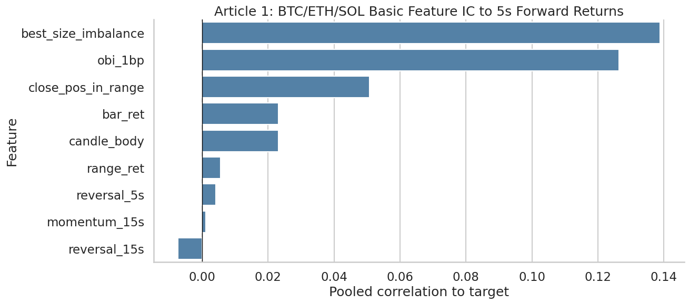](images/29618295f682.png)

[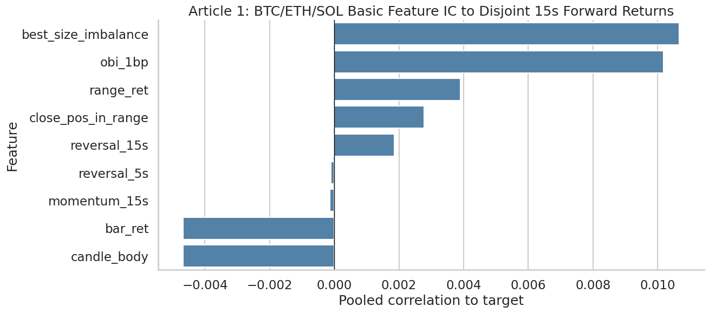](images/162bd6a0fe11.png)

It’s pretty clear that orderbook imbalance is our strongest feature and works across both horizons. Momentum seems very weak. Let’s see how our features do on the backtest, first looking at Sharpes:

[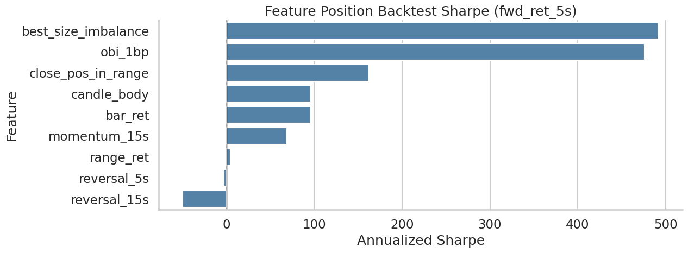](images/023a281be091.png)

[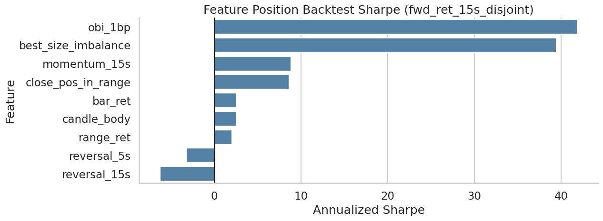](images/80fdc3746785.png)

Orderbook imbalance is still the strongest, but the others are significantly weaker, especially for 15s.

[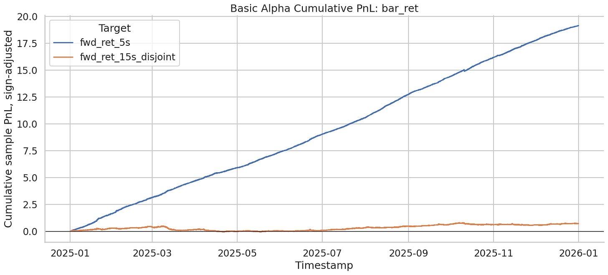](images/b8e201219fda.png)

[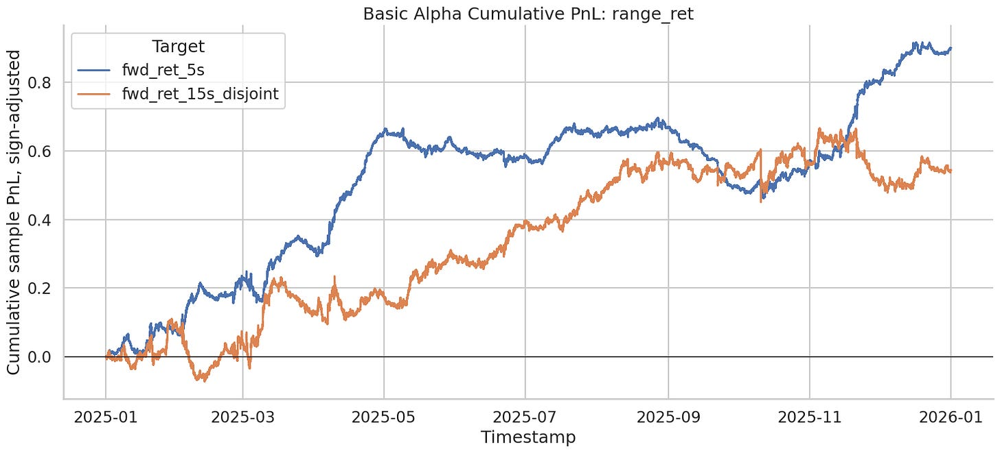](images/f64be5067ed6.png)

[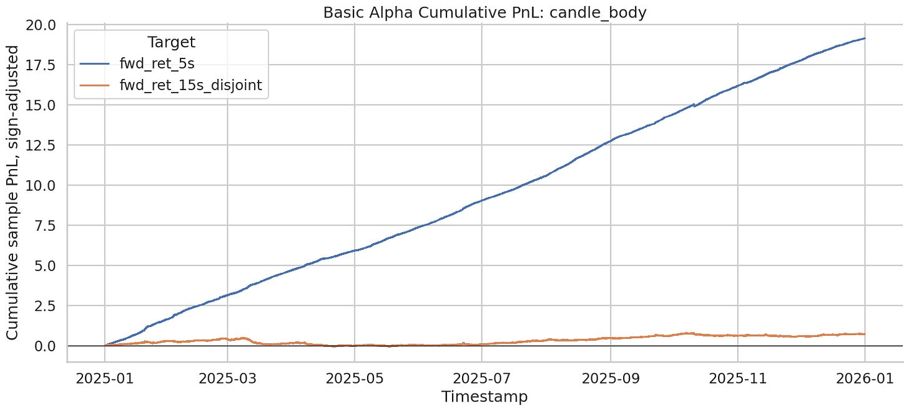](images/a5b681e175b0.png)

[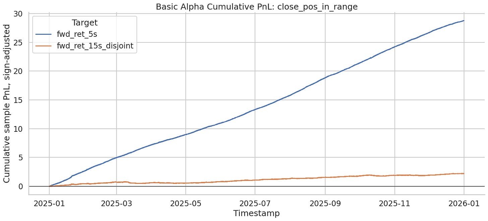](images/767118bdb989.png)

[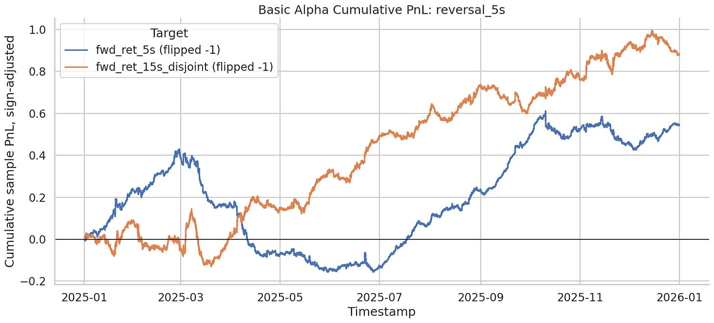](images/be3ebeca0b24.png)

[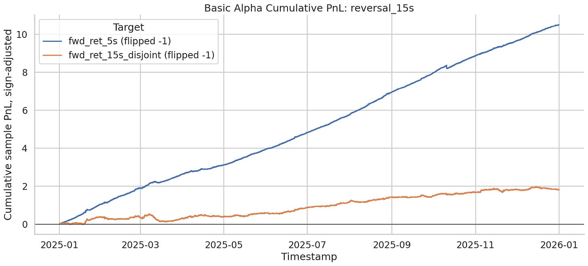](images/1df75c3fd3be.png)

[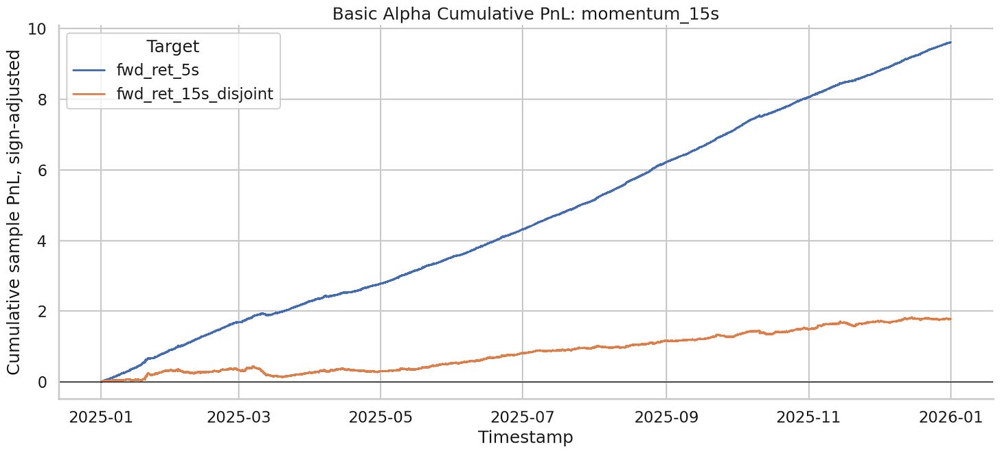](images/699f8b24c19f.png)

[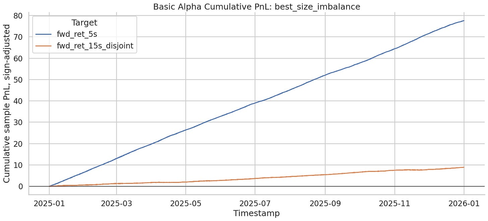](images/2400f4cc74bc.png)

[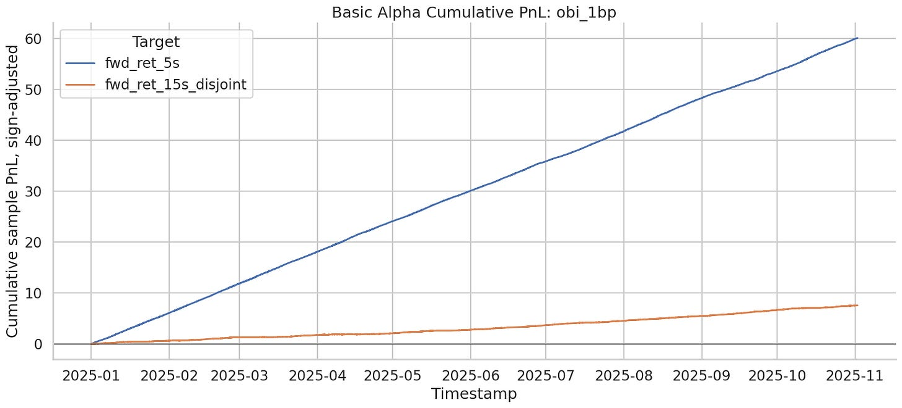](images/b05750ebc3a4.png)

It is clear from the backtests that the 5s timeframe has the strongest alphas, and that for both 5s/15s timeframes orderbook imbalance is extremely high Sharpe. So we’ll add both orderbook features to our selected features for both. range\_ret and reversal\_5s are both bad, we will drop these. close\_pos\_in\_range, reversal\_15s, momentum\_15s, candle\_body, and bar\_ret are all good for the 5s timeframe, let’s have a look at how they do for the 15s timeframe by plotting all non orderbook features on the 15s horizon:

[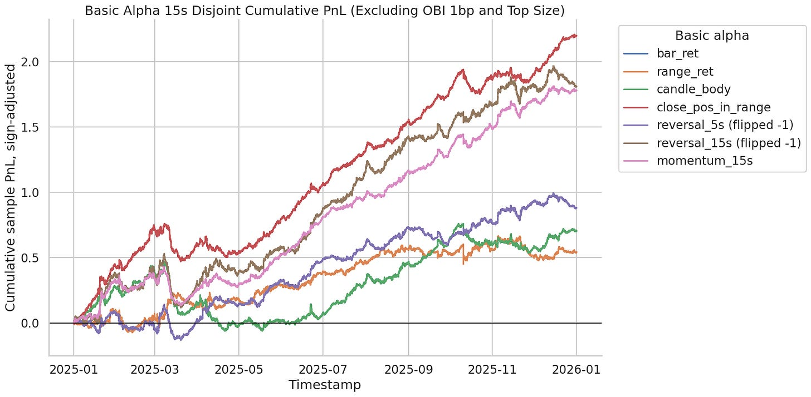](images/de21a21b1ec2.png)

I’d consider close\_pos\_in\_range, reversal\_15s, and momentum\_15s worth keeping - drop the rest.

So as our final feature sets we have:

```
features_5s = [
 'best_size_imbalance',
 'candle_body',
 'close_pos_in_range',
 'momentum_15s',
 'obi_1bp',
 'bar_ret',
 'reversal_15s',
]

features_15s = [
 'close_pos_in_range',
 'reversal_15s',
 'momentum_15s',
 'best_size_imbalance',
 'obi_1bp'
]
```

### Conclusions

---

Orderbook imbalance dominates performance wise which is expected although the reversal effect was rather weak despite its high strength on the 1min-1h timeframes (known prior). We were able to find multiple features for the 5s lookahead although we could do with a few more, and we definitely do not have enough features for the 15s timeframe.

The question remains as to whether features are independent, the curves for obi\_1bp and best\_size\_imbalance look very similar, so we will residualize them and do an analysis of their independence later in article 3 when we do factor modelling and feature selection. In the next article (part 2), we will focus on finding features which improve our 15s horizon and add to our 5s horizon.
