# 2026 06 17 Hft Alphas Pt 2

Source HTML: [`html/2026-06-17-hft-alphas-pt-2.html`](../html/2026-06-17-hft-alphas-pt-2.html)

### Introduction

---

In this article, we will extend the work of the first article (below) and develop a full feature set for our forecasting model. This will be fairly basic, and will not be the final feature set. We will do some selection in the next article, develop a factor model, and then use that factor model in article 4 to develop advanced features and build out the final forecasting set. We were able to find many features that scored over 5 Sharpe pre-fees, and now have our set of features for article 3.

[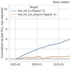

#### HFT Alphas Pt. 1

[Quant Arb](https://substack.com/profile/101799233-quant-arb)

·

Jun 8

[Read full story](https://www.algos.org/p/hft-alphas-pt-1)](https://www.algos.org/p/hft-alphas-pt-1)

This will be a fairly short article where we simply test our alpha candidates and select the best, but it will provide us with our feature set to be used in the next few articles which we will then use to finally develop our forecast.

The Quant Stack is a reader-supported publication. To receive new posts and support my work, consider becoming a free or paid subscriber.

Subscribed

### Index

---

1. Introduction
2. Index
3. Alphas
4. Analysis
5. Conclusions

### Alphas

---

In the prior article, we tested some basic alphas so in today’s article we will extend the selection and test more alphas for a total of 30 alphas tested. In the next article, we will thin down the set and remove duplicated alphas as well as residualize correlated alphas against each other, then we will develop a factor model so that we can continue testing without issue. Below are our definitions for our alphas:

volumet=∑τ∈ttrade\_volumeτ

buy\_volumet=∑τ∈tbuy\_volumeτ

sell\_volumet=∑τ∈tsell\_volumeτ

tradest=∑τ∈ttradesτ

spread\_bpsτ=10000⋅ask\_priceτ−bid\_priceτ(ask\_priceτ+bid\_priceτ)/2

spread\_bps\_meant=meanτ∈t(spread\_bpsτ)

spread\_bps\_lastt=spread\_bpslast,t

log\_ret\_5st=log⁡(closet)−log⁡(closet−1)

trade\_volume\_imbalancet=buy\_volumet−sell\_volumetvolumet

buy\_volume\_sharet=buy\_volumetvolumet

log\_volumet=log⁡(1+volumet)

log\_tradest=log⁡(1+tradest)

reversal\_30st=−(log⁡(closet)−log⁡(closet−6))

reversal\_60st=−(log⁡(closet)−log⁡(closet−12))

momentum\_60st=12⋅mean12(log\_ret\_5s)tstd12(log\_ret\_5s)t

volume\_spike\_1mt=volumetmean12(volume)t

volume\_spike\_5mt=volumetmean60(volume)t

volume\_zscore\_5mt=volumet−mean60(volume)tstd60(volume)t

volume\_imbalance\_demeaned\_5mt=trade\_volume\_imbalancet−mean60(trade\_volume\_imbalance)t

rv\_1mt=std12(log\_ret\_5s)t

rv\_5mt=std60(log\_ret\_5s)t

realized\_vol\_1mt=sum12(log\_ret\_5s2)t

realized\_vol\_5mt=sum60(log\_ret\_5s2)t

range\_mean\_1mt=mean12(range\_ret)t

spread\_bps\_mean\_1mt=mean12(spread\_bps\_mean)t

obi\_5bpt=bid\_usd\_5bpst−ask\_usd\_5bpstbid\_usd\_5bpst+ask\_usd\_5bpst

obi\_10bpt=bid\_usd\_10bpst−ask\_usd\_10bpstbid\_usd\_10bpst+ask\_usd\_10bpst

### Analysis

---

Starting with correlations vs forward returns, we can see clearly that our orderbook features as well as close pos in range remain at the top of our feature rankings. Interestingly, we now have some interesting volume features which have strong predictive ability:

[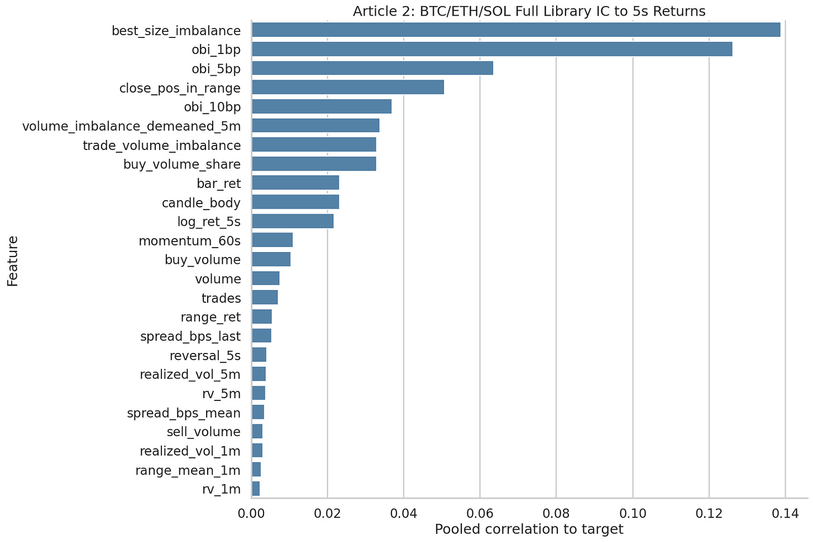](images/d89f9bf9119f.png)

For longer horizons, we see a much more diverse mix of features including volatility:

[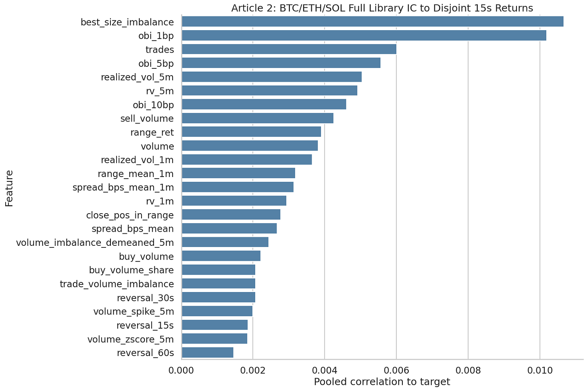](images/ef5ebd837751.png)

Testing our best features, we see our Sharpes are fairly significant for the volume features:

[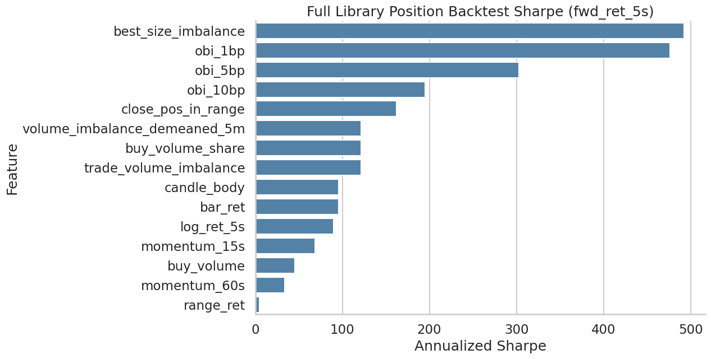](images/5a51b76c5894.png)

and that volume features continue to be our next-best features after orderbook imbalance for 15s:

[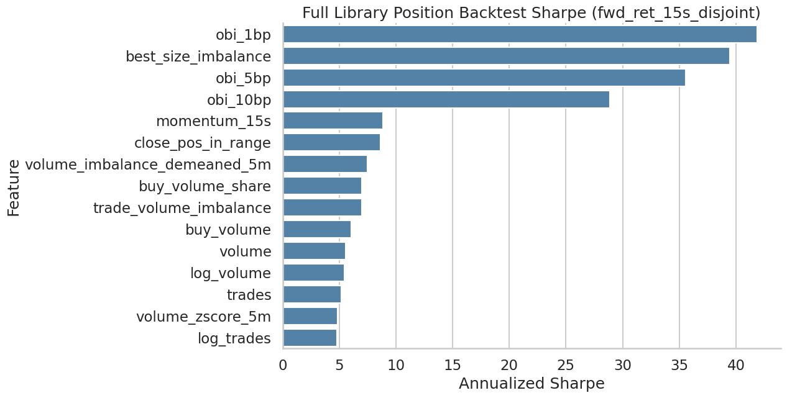](images/c0e664ead837.png)

Doing a test of our orderbook features, we see very smooth curves, so these are likely all potential candidates (although we will thin these down later and orthogonalize them in the next article as they are surely correlated):

[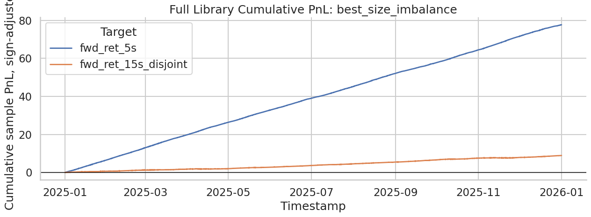](images/8caf994ad6e9.png)

[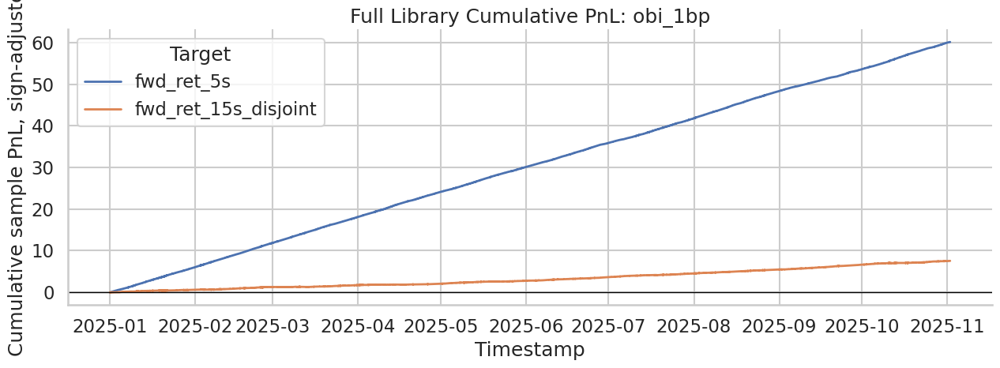](images/605ec8e888c8.png)

[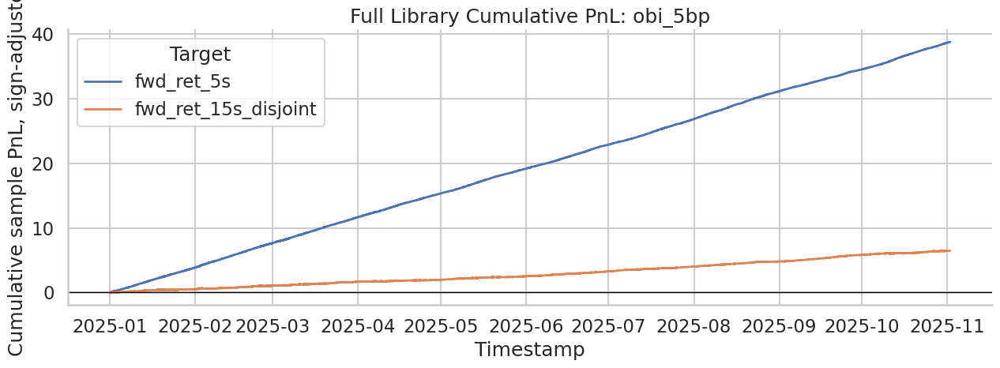](images/d31cdb044efd.png)

[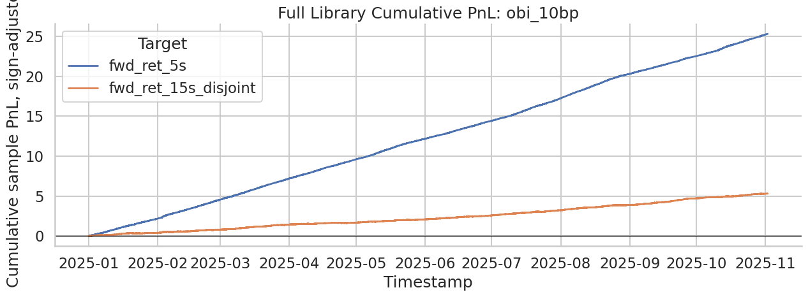](images/00c9187afd68.png)

Close pos in range is then our next best (same as in the prior article):

[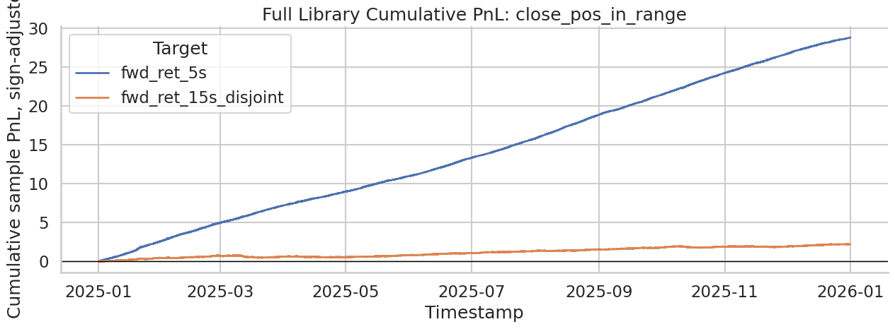](images/ffe44fb6043d.png)

For our volume features, we see strong returns as well:

[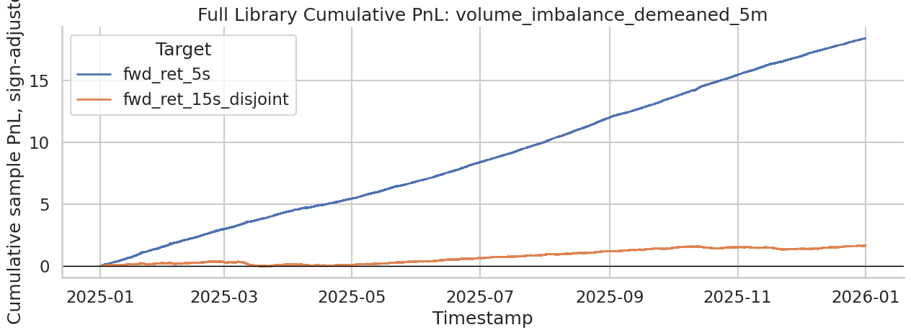](images/21ea75602c6d.png)

[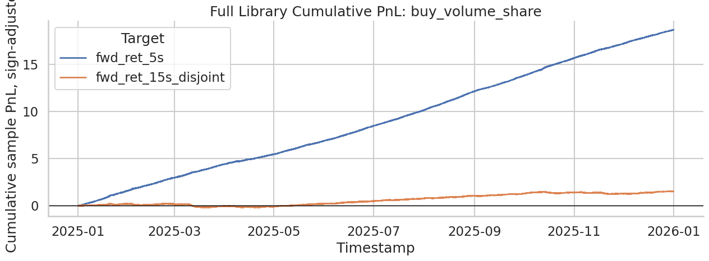](images/452e2bb5f4a0.png)

[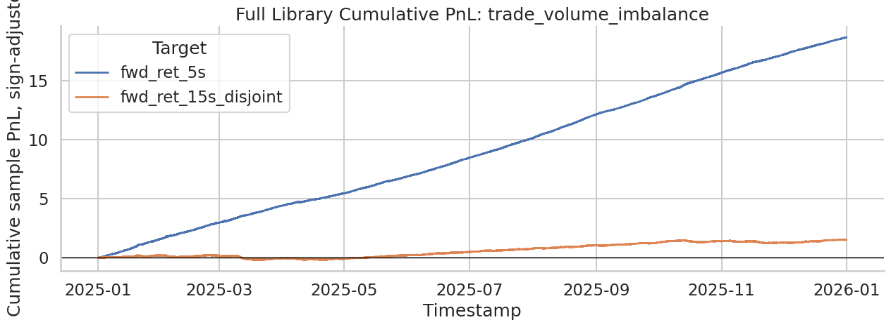](images/ccb5906f41fc.png)

[](images/c5b7ae4f68a2.png)

[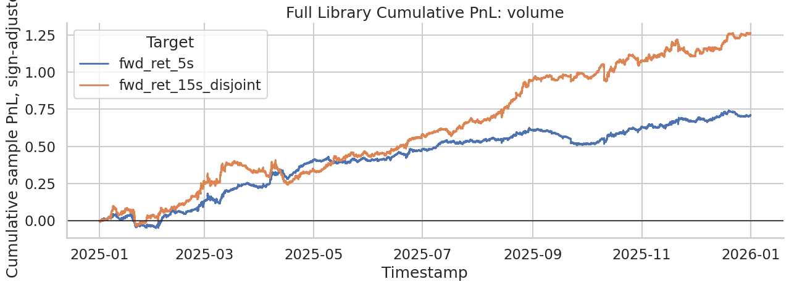](images/a46cfdc2a7b8.png)

Overall volume is a bit choppier than others, but still worth including. The 15s horizons are a bit drowned out so I will plot them again before deciding whether or not to keep them in our model. The return-based features also work well:

[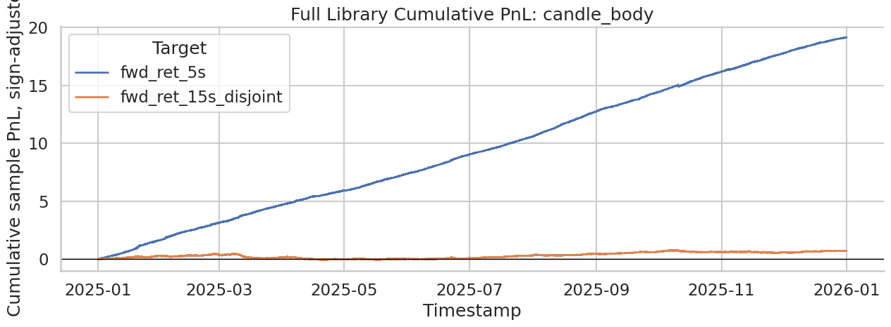](images/0a7c1a5d4bcb.png)

[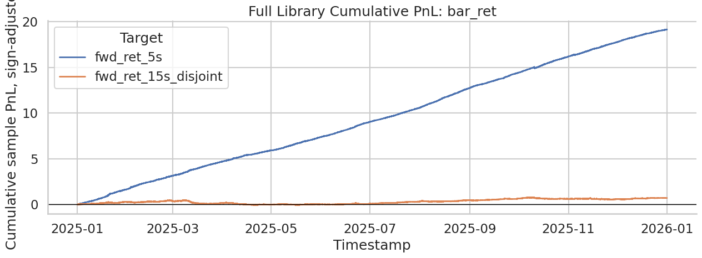](images/3d278e9d158c.png)

[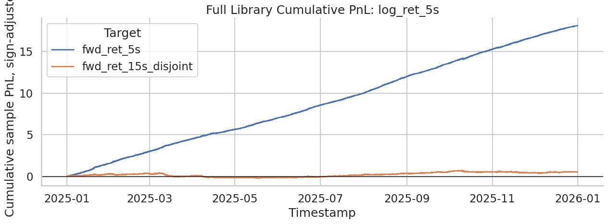](images/ffba42bc5a3f.png)

[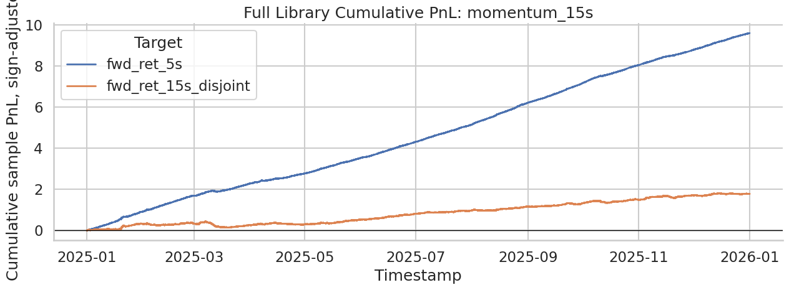](images/d52783959f96.png)

[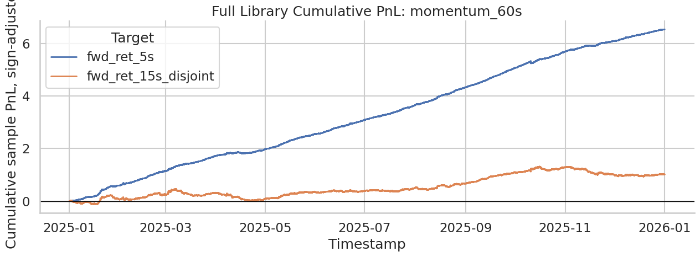](images/10745630246f.png)

Testing only the 15s horizons, we see that a lot of our features are worth keeping. I have excluded any features scoring below 5 sharpe (using 5 sharpe raw signal strength as my cutoff) from the analysis automatically. We can relax it later once we have good factor modelling. Even the choppy ones are probably still good enough to keep in raw performance. We will need to residualize and do correlation analysis to properly exclude them:

[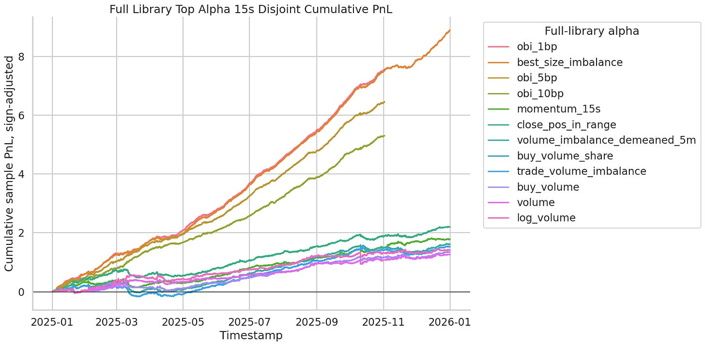](images/47c5a825b4ff.png)

### Conclusions

---

We now have our feature set, which we outline as:

```
# 5s
features_5s = [
    "best_size_imbalance",
    "obi_1bp",
    "obi_5bp",
    "obi_10bp",
    "close_pos_in_range",
    "volume_imbalance_demeaned_5m",
    "buy_volume_share",
    "trade_volume_imbalance",
    "candle_body",
    "bar_ret",
    "log_ret_5s",
    "momentum_15s",
    "buy_volume",
    "momentum_60s",
]

# 15s
features_15s = [
    "obi_1bp",
    "best_size_imbalance",
    "obi_5bp",
    "obi_10bp",
    "momentum_15s",
    "close_pos_in_range",
    "volume_imbalance_demeaned_5m",
    "buy_volume_share",
    "trade_volume_imbalance",
    "buy_volume",
    "volume",
    "log_volume",
]
```

I have also had quite a few messages regarding the methodology and how we generate the backtests. For all the articles, we are using the methods outlined in the HFT Alpha Research 101 article.

[

#### HFT Alpha Research 101

[Quant Arb](https://substack.com/profile/101799233-quant-arb)

·

Jun 3

[Read full story](https://www.algos.org/p/hft-alpha-research-101)](https://www.algos.org/p/hft-alpha-research-101)
